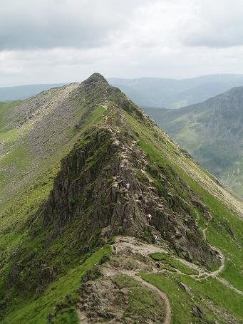
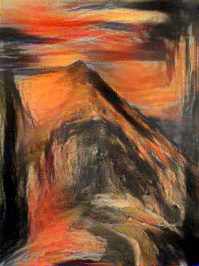

# Neural Style Transfer

ITMO University course task

> [A Neural Algorithm of Artistic Style](https://arxiv.org/abs/1508.06576)
>
> Read the paper and implement the idea of style transfer, using any pretrained convolutional model you like.

An example:

+ 
= 
